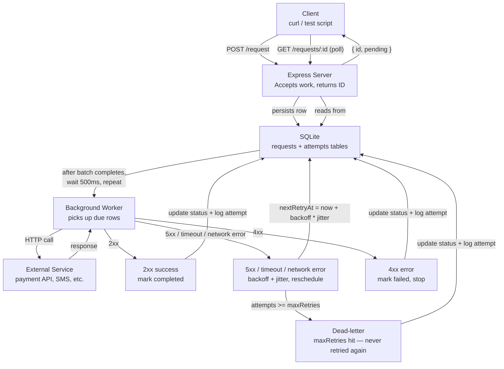

# RETRY ENGINE

This retry engine is a small HTTP service that takes in a HTTP request with some crucial metadata, and retries the requests according to configuration

## SETUP

### Prerequisites

- Node.js v18+ (v24 recommended - native `fetch` is available)
- pnpm

### Install & Start

```bash
git clone <repo-url>
cd retry_engine
pnpm install
pnpm dev
```

The server starts on port `3001`.

> **Note:** `better-sqlite3` requires a native binary. If you get a bindings error on first run, rebuild it:
>
> ```bash
> npx node-gyp rebuild --directory node_modules/.pnpm/better-sqlite3@12.10.0/node_modules/better-sqlite3
> ```

---

### Endpoints

#### POST /request

Queue a new HTTP request for the retry engine to execute.

```bash
curl -X POST http://localhost:3001/request \
  -H "Content-Type: application/json" \
  -d '{
    "url": "https://example.com/api/endpoint",
    "method": "POST",
    "body": { "key": "value" },
    "maxRetries": 5,
    "backoffMs": 1000
  }'
```

`body`, `maxRetries`, and `backoffMs` are optional. Defaults: `maxRetries=5`, `backoffMs=1000`.

Response:

```json
{ "status": "success", "data": { "id": "<uuid>", "status": "pending" } }
```

---

#### GET /requests/:id

Get a request and its full attempt history.

```bash
curl http://localhost:3001/requests/<id>
```

---

#### GET /requests?status=

List requests filtered by status. Valid statuses: `pending`, `retrying`, `completed`, `failed`.

```bash
# get all failed requests
curl "http://localhost:3001/requests?status=failed"

# get all requests (no filter)
curl http://localhost:3001/requests
```

## ARCHITECTURE DIAGRAM



### Architectural Decisions and Design Justification:

## CORE CONCEPTS

In the ecosystem of network flows, request-respond relationships between servers and clients, the requests sometimes fail, and the responses in a well-built system give reasons as to why the request fails, and universally-agreed status codes help engineers with understanding failure reasons.
The failure can be due to the user not being authorized to interact with the requested resource, it can be as a result of the resource not being found altogether, it can be as a result of the user not having the right role.
It can also be as a result of the server going down for a short period, network errors, or anything at all. Errors that are not as a result of the client eligibility are called **Transient Errors**.
Transient errors resolve themselves automatically, and the defining characteristic of a transient error is that if you retried the request, the request would likely succeed, because the underlying issue has self-resolved.

When a service experiences an outage for instance, clients that are making requests fail, and if they are configured to retry, the retry their requests simultaneously. This could result in a sudden spike in traffic, and overwhelm the recovering service, preventing recovery and cascading failures across the system.

The real world consequence is that the service recovers briefly, and then due to the spike, it crashes again under retry load, and this continues, and then the system enters a failure loop instead of healing gracefully.

That is where **Exponential Backoff** would come in.
Exponential backoff solves this issue by spacing out retry attempts, waiting increasingly before each retry, instead of retrying immediately.
It basically gives the system breathing space after the spike, or whatever went wrong to get right in the system, before the requests come rushing at it again.

### WHY JITTER MATTERS

As seen, afer the backoff period, the requests come pounding at the recovering service again, and what exactly is stopping the same crash from repeating? The case results in another **THUNDERING HERD**.

Instead of each of the requests being tried at the same time when time, a random variable is thrown in to vary the times in which they try, while keeping the average period the same. For instance, if the clients are to retry the request in 10 seconds, jitter makes it that the retry times for the clients would vary between 9.5 seconds and 10.5 seconds instead, so that the server can handle these requests better.
There are several jitter strategies - Full Jitter, Equal Jitter, Decorrelated Jitter, etc.

## TEST BREAKDOWN

The test script (`test-script.ts`) spins up a mock HTTP server on port `3002` and runs three scenarios independently via a CLI argument:

```bash
npx tsx test-script.ts flaky        # scenario 1
npx tsx test-script.ts 404          # scenario 2
npx tsx test-script.ts deadletter   # scenario 3
```

---

### Scenario 1: `flaky` - fails 3 times, then succeeds

The mock `/flaky` endpoint tracks how many times it has been hit. It returns `500` for the first 3 hits, then `200` on the 4th.

This is the core scenario. It proves that:

- The worker retries on 5xx responses
- The backoff doubles between each attempt
- Jitter is applied (the waits are not perfectly round numbers)
- The request eventually reaches `completed` status
- All 4 attempts are recorded in the attempt history

This is also the scenario used for the demo video and the README screenshots.

---

### Scenario 2: `404` - terminal error, never retried

The mock `/always-404` endpoint always returns `404`.

This proves the non-retryable path. A 4xx response means the problem is on the client side — wrong URL, resource doesn't exist, not authorised. Retrying it will never help. The worker should mark it `failed` immediately after the first attempt and never touch it again.

Expected: exactly 1 attempt, final status `failed`.

This is an important correctness check. Without it, a misconfigured request could hammer an external service indefinitely.

---

### Scenario 3: `deadletter` - always 500, hits maxRetries

The mock `/always-500` endpoint always returns `500`. The request is submitted with `maxRetries: 3`.

This proves the dead-letter path. Even for retryable errors, there has to be a ceiling — you cannot retry forever. Once `attempt_count >= maxRetries`, the worker marks the request `failed` and stops. It will never be picked up again.

Expected: exactly 3 attempts, final status `failed`.

This is what separates a retry engine from an infinite loop. The dead-letter guarantee is what makes the system safe to run in production.

## SCREENSHOTS

Here are two screenshots of a request that failed 3 times and eventually passed on the fourth trial, born from my `test-script.ts`:


### VIDEO

Here is a [video](https://youtu.be/4t29lHkskWg) of the test script running, with the flaky case:

From the video, the first attempt waited 2.71 seconds, the second waited 5.02 seconds, and the third waited 7.52 seconds

Here is the math that backs these numbers:

## ISSUES STRUGGLED WITH

Some issues were struggled with, such as:

- Using `better-sqlite3`: installing better sqlite3 was easy, but apparently, pnpm rebuild was not building the binary, and so the log to the console at the bottom of the db.ts file was resulting in an error when I ran `npx tsx db.ts`, to ensure it worked.
  The solution was the following command:
  `node-pre-gyp rebuild --directory node_modules/.pnpm/better-sqlite3@12.10.0/node_modules/better-sqlite3 2>&1 || npx node-gyp rebuild --directory node_modules/.pnpm/better-sqlite3@12.10.0/node_modules/better-sqlite3 2>&1`
  Only then did the native binary build successfully.

There were things I was also confused about, but I guess you will see what I did in the code:

- Retryable requests: The requests can be summed up easily as 5xx -> Retryable, and 4xx -> not retryable, but I had two specific response types that are 4xx, but I think might be retryable.
  A request that responds with a status code of 429 represents rate limiting, rather than the client explicit forbidden fault, or unauthorization. This means that retrying the request will likely succeed as well, which is kind of the point of this worker.
  Another one like that is those with response status of 408 -> that literally is a request timeout.
  In my opinion, it is retryable, so I added it to my retryable request i.e. shouldRetry(408) returns true.
  However, I did not add 429 because I had a certain experience. When working with langchain to integrate AI last week, I noticed that when my api key for the gemini model had exhausted its allowed tokens, I got a 429 response. This means there are two completely separate cases of 429:
- - One of them is the genuine rate limiting, where you are trying to reduce load on the server by allowing only a number of requests per second.
- - The other is when the user is authenticated, has the correct role, but is not able to access the resource, due to an issue like the tokens exhausting.

The first case is retryable, but the second case is not. To be on the safe side, I removed 429 from my "allowList".

## WHAT I LEARNED:

### Concepts:

### Patterns:

### Language/Framework Features

### Debugging Techniques

## RESOURCES CONSULTED

## WHY THE PROJECT MADE ME A BETTER BACKEND DEVELOPER
