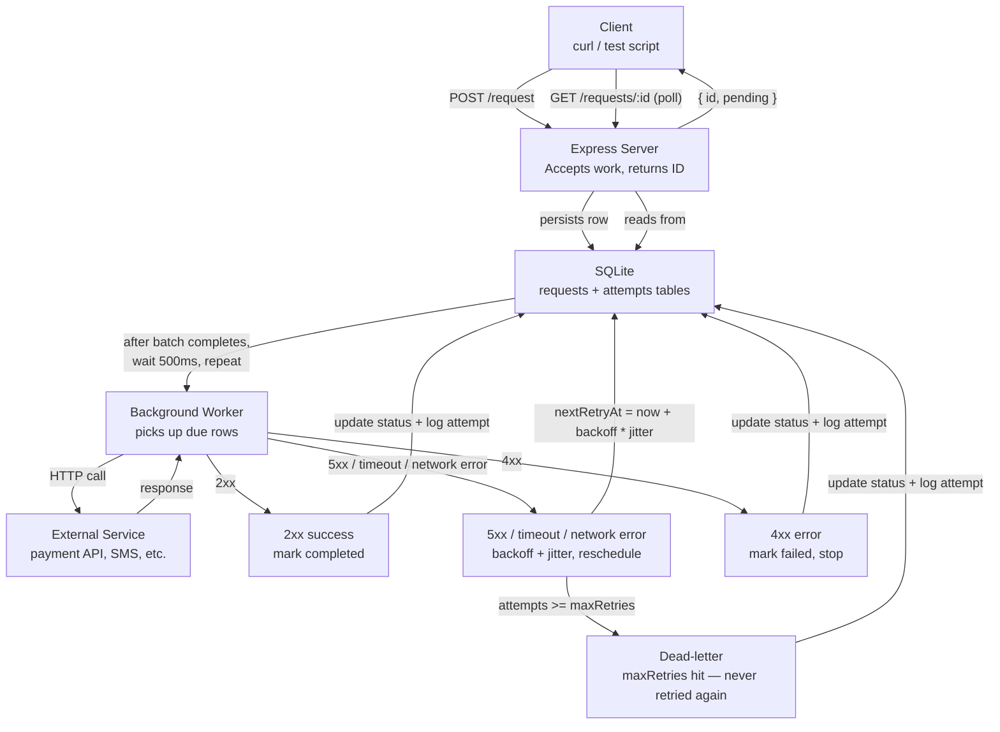
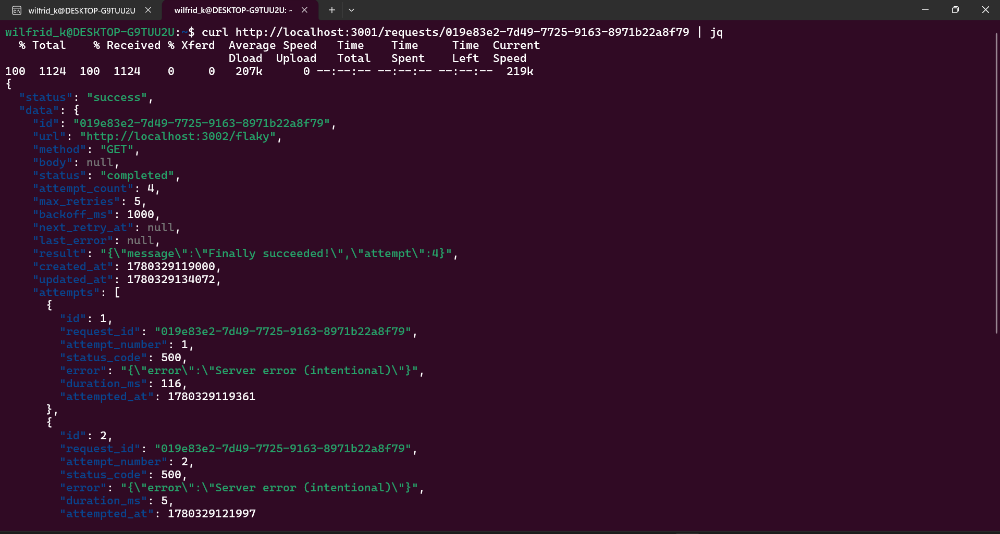
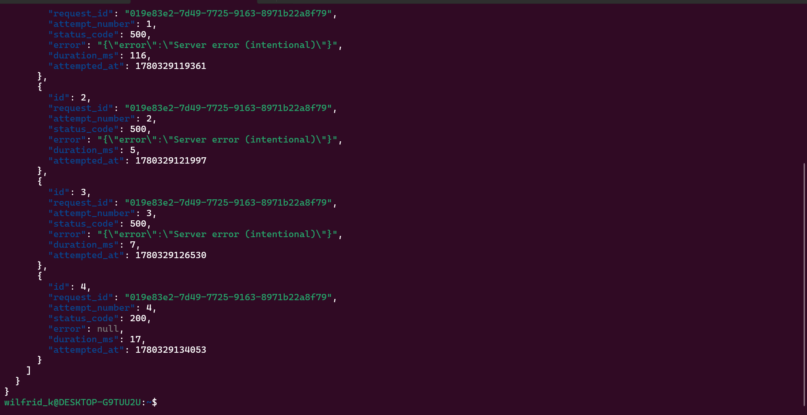

# RETRY ENGINE

This retry engine is a small HTTP service that acts as a reliable proxy for outbound HTTP requests. Instead of making a request directly and hoping it succeeds, you hand it off to this service, it persists the job, returns immediately with an ID, and a background worker handles the actual call. If the call fails with a retryable error, the worker backs off and tries again. If it fails permanently (4xx, or maxRetries exhausted), it stops and marks the job dead.

The practical use case: your payment service calls a bank API. The bank is briefly down. Instead of losing that transaction or blocking your thread, you queue it here and let the retry engine handle the resilience.

## SETUP

### Prerequisites

- Node.js v18+ (v24 recommended - native `fetch` is available)
- pnpm

### Install & Start

```bash
git clone https://github.com/OWK50GA/retry_engine
cd retry_engine
pnpm install
pnpm dev
```

The server starts on port `3001`.

> **Note:** `better-sqlite3` requires a native binary. If you get a bindings error on first run, rebuild it:
>
> ```bash
> npx node-gyp rebuild --directory node_modules/.pnpm/better-sqlite3@12.10.0/node_modules/better-sqlite3
> ```

---

### Endpoints

#### POST /request

Queue a new HTTP request for the retry engine to execute.

```bash
curl -X POST http://localhost:3001/request \
  -H "Content-Type: application/json" \
  -d '{
    "url": "https://example.com/api/endpoint",
    "method": "POST",
    "body": { "key": "value" },
    "maxRetries": 5,
    "backoffMs": 1000
  }'
```

`body`, `maxRetries`, and `backoffMs` are optional. Defaults: `maxRetries=5`, `backoffMs=1000`.

Response:

```json
{ "status": "success", "data": { "id": "<uuid>", "status": "pending" } }
```

---

#### GET /requests/:id

Get a request and its full attempt history.

```bash
curl http://localhost:3001/requests/<id>
```

---

#### GET /requests?status=

List requests filtered by status. Valid statuses: `pending`, `retrying`, `completed`, `failed`.

```bash
# get all failed requests
curl "http://localhost:3001/requests?status=failed"

# get all requests (no filter)
curl http://localhost:3001/requests
```

## ARCHITECTURE DIAGRAM



### Architectural Decisions and Design Justification:

- **Recursive `setTimeout` over `setInterval`** - a simple `setInterval` would fire every 500ms, regardless of whether the previous batch is finished. Some requests take more than 500ms.
Say `Tick A` is processing, and has taken up to 500ms. `Tick B` can actually start, and when it does, it tries to select rows that are eligible. It can actually see that a row doesn't show failed or completed yet, and has an eligible time. In this case, it picks up the same request to work on. This is not desirable behaviour. `setTimeout` waits for the batch to complete before scheduling the next tick.
- **`next_retry_at` as the claim lock instead of a `claimed` boolean**: as a way to go around the first problem, as it is a valid alternative. However, there is a special case.
Assume the db has a `claimed` row, and this is marked as true before processing starts, the row now prevents any other worker from picking it up. Now if the server crashes in-process, the `claimed` row remains `true` forever, and is never retried. For `next_retry_at`, it is marked with a period in the future when its retryable, so even if the server crashes in-process, when a future worker wakes up, it can pick the row that was claimed.
- **408 retryable, 429 not**: 408 is a request timeout, which is genuinely a transient failure. In this case, the request didn't fail because the user is not eligible or anything like that, meaning if it is retried, the request would probably succeed, which is the core concept of transient failures, and retry-worthy failures. One can argue that 429 is also such a request, but it was excluded because 429 responses appear on two distinct cases: genuine rate-limiting is retryable, and the response type here is 429. However, there is another case of resource exhaustion like API token limits, which are not always retryable. To be on the safe side, they are not retried. Though, a valid argument is that if that be the case, they fail permanently anyway after a number of retries, so it wouldn't be wrong to keep trying. Genuine grey area. In my opinion, the class of resource exhaustion should be given a different status code than 429, but it is not that simple given that sometimes this resource exhaustion can be temporary, other times it can be permanent.
- **Defaults applied in the route handler, not relying on DB defaults**: SQLite defaults only apply when a column is omitted from INSERT entirely. Since backoffMs and maxRetries are configurable, they are added to the query, because the user can provide them. If we therefore make the query without them, it fails in the db. Sending `undefined` violates the **NOT NULL** constraint. Resolving defaults in code is the solution to avoid this.
- **Using Promise.all() to make requests**: it is almost too obvious at this point, but we cannot make the requests sequentially for every eligible row in the DB. This would result in massive lags even for as little as 3 requests in a row. We have to make them in parallel. In this case, we don't need to return anything from them, because internally, they all handle their db writes and any other interactions, using the `makeRequest()` function

## CORE CONCEPTS

In the ecosystem of network flows, request-respond relationships between servers and clients, the requests sometimes fail, and the responses in a well-built system give reasons as to why the request fails, and universally-agreed status codes help engineers with understanding failure reasons.
The failure can be due to the user not being authorized to interact with the requested resource, it can be as a result of the resource not being found altogether, it can be as a result of the user not having the right role.
It can also be as a result of the server going down for a short period, network errors, or anything at all. Errors that are not as a result of the client eligibility are called **Transient Errors**.
Transient errors resolve themselves automatically, and the defining characteristic of a transient error is that if you retried the request, the request would likely succeed, because the underlying issue has self-resolved.

When a service experiences an outage for instance, clients that are making requests fail, and if they are configured to retry, the retry their requests simultaneously. This could result in a sudden spike in traffic, and overwhelm the recovering service, preventing recovery and cascading failures across the system.

The real world consequence is that the service recovers briefly, and then due to the spike, it crashes again under retry load, and this continues, and then the system enters a failure loop instead of healing gracefully.

That is where **Exponential Backoff** would come in.
Exponential backoff solves this issue by spacing out retry attempts, waiting increasingly before each retry, instead of retrying immediately.
It basically gives the system breathing space after the spike, or whatever went wrong to get right in the system, before the requests come rushing at it again.

### WHY JITTER MATTERS

As seen, afer the backoff period, the requests come pounding at the recovering service again, and what exactly is stopping the same crash from repeating? The case results in another **THUNDERING HERD**.

Instead of each of the requests being tried at the same time when time, a random variable is thrown in to vary the times in which they try, while keeping the average period the same. For instance, if the clients are to retry the request in 10 seconds, jitter makes it that the retry times for the clients would vary between 9.5 seconds and 10.5 seconds instead, so that the server can handle these requests better.
There are several jitter strategies - Full Jitter, Equal Jitter, Decorrelated Jitter, etc.

## TEST BREAKDOWN

The test script (`test-script.ts`) spins up a mock HTTP server on port `3002` and runs three scenarios independently via a CLI argument:

```bash
npx tsx test-script.ts flaky        # scenario 1
npx tsx test-script.ts 404          # scenario 2
npx tsx test-script.ts deadletter   # scenario 3
```

---

### Scenario 1: `flaky` - fails 3 times, then succeeds

The mock `/flaky` endpoint tracks how many times it has been hit. It returns `500` for the first 3 hits, then `200` on the 4th.

This is the core scenario. It proves that:

- The worker retries on 5xx responses
- The backoff doubles between each attempt
- Jitter is applied (the waits are not perfectly round numbers)
- The request eventually reaches `completed` status
- All 4 attempts are recorded in the attempt history

This is also the scenario used for the demo video and the README screenshots.

---

### Scenario 2: `404` - terminal error, never retried

The mock `/always-404` endpoint always returns `404`.

This proves the non-retryable path. A 4xx response means the problem is on the client side — wrong URL, resource doesn't exist, not authorised. Retrying it will never help. The worker should mark it `failed` immediately after the first attempt and never touch it again.

Expected: exactly 1 attempt, final status `failed`.

This is an important correctness check. Without it, a misconfigured request could hammer an external service indefinitely.

---

### Scenario 3: `deadletter` - always 500, hits maxRetries

The mock `/always-500` endpoint always returns `500`. The request is submitted with `maxRetries: 3`.

This proves the dead-letter path. Even for retryable errors, there has to be a ceiling — you cannot retry forever. Once `attempt_count >= maxRetries`, the worker marks the request `failed` and stops. It will never be picked up again.

Expected: exactly 3 attempts, final status `failed`.

This is what separates a retry engine from an infinite loop. The dead-letter guarantee is what makes the system safe to run in production.

## SCREENSHOTS

Here are two screenshots of a request that failed 3 times and eventually passed on the fourth trial, born from my `test-script.ts`:





### VIDEO

Here is a [video](https://youtu.be/4t29lHkskWg) of the test script running, with the flaky case:

From the video, the first attempt waited 2.67 seconds, the second waited 4.02 seconds, and the third waited 7.02 seconds

Here is the math that backs these numbers:

The backoff formula gives a wait duration, and this wait duration is the time between when the row sits in the database, and the time before eligible to be picked. Not the time between when it sits and when it is actually picked, because being eligible doesn't mean being picked immediately.

When an attempt fails:
- The worker sets next_retry_at = now() + wait, and writes it to the db
- The worker finishes, and schedules itself to run again in 500 milliseconds
- At the appointed time, the worker wakes up, and queries the database for due rows. If next_retry_at <= now() for any row, the row is picked up by the worker

The actual gap between attempts becomes:

```
actual_gap = backoff_wait + time until next worker tick + time to make the HTTP call.
```

The HTTP call to the mock server takes 5 - 7 milliseconds, the worker tick adds up to 500ms of scheduling delay.
For a 2s backoff: 
```
wait = 1000 * 2^1 * [0.8 - 1.2]
```
This would mean the min value = 1600ms, and the max value would be 2400ms. It got picked after 2.71 seconds (2705 - 2714ms), which is not abnormal

However, this is the time until it is eligible. Other processing overhead, including scheduling and db writing would result in the job most probably being picked up some milliseconds after it is available to be picked up.

For a 4s backoff:
```
wait = 1000 * 2^2 * [0.8 - 1.2]
```

This would mean the min value is 3200ms, and the max value is 4800ms - it got picked after 5.02 seconds (5015ms - 5024ms), which is not abnormal either

For an 8s backoff:
```
1000 * 2^3 * [0.8 - 1.2]
```
This would mean the min value is 6400ms, and the max value is 9600ms - it got picked after 7.52 seconds, which makes sense considering the previous delays, and the similarity of the workload in each of the cases.

## ISSUES STRUGGLED WITH

Some issues were struggled with, such as:

- Using `better-sqlite3`: installing better sqlite3 was easy, but apparently, pnpm rebuild was not building the binary, and so the log to the console at the bottom of the db.ts file was resulting in an error when I ran `npx tsx db.ts`, to ensure it worked.
  The solution was the following command:
  `node-pre-gyp rebuild --directory node_modules/.pnpm/better-sqlite3@12.10.0/node_modules/better-sqlite3 2>&1 || npx node-gyp rebuild --directory node_modules/.pnpm/better-sqlite3@12.10.0/node_modules/better-sqlite3 2>&1`
  Only then did the native binary build successfully.
- **__dirname not defined is ES module scope**: node treated the `.ts` file as ESM because of `import` syntax, but it seems to be commonjs only. I had to revert to raw **__dirname**, and it works fine anyway, since tsx compiles to cjs.

There were things I was also confused about, but I guess you will see what I did in the code:

- Retryable requests: The requests can be summed up easily as 5xx -> Retryable, and 4xx -> this is in line with the design decision mentioned above regarding retryable requests. It was difficult to make that decision, and I only made it to avoid too many 4xx requests getting into the retryable domain, because it seemed like a genuine 50-50

## WHAT I LEARNED:

### Concepts:
- How workers are actually just setIntervals or recursive setTimeout calls with a memory-layer, like DB or redis for **BullMQ**.
- How exponential backoff and jitter work mathematically, not just conceptually
- The thundering herd problem and why jitter solves it
- What transient errors are and why the distinction between client errors and server errors matter for retry logic, and cases of exceptions
- How SQLite DB works, using it for the first time

### Patterns:
- The claim-before-process pattern: previously learned in Web3 and applied here, to prevent duplicate work in polling workers
- Using future time as self-healing lock instead of boolean flags all the time
- How recursive `setTimeouts` can be a safe alternative to `setInterval` for async work loops

### Language/Framework Features
- How sqlite statements work, with named parameters using `@` and positional using `?`.

### Debugging Techniques
- Using `console.time()` to track time in the console. Used in debugging, but not currently present

## RESOURCES CONSULTED

Some resources I consulted for this task are:

### YouTube:
- [Retries & Exponential Backoff - Deep Dive](https://youtu.be/EW2Cc0r2mbc?si=Qv4nKM8ekk0WyKcv)
- [Retry Strategies: Exponential Backoff & Jitter Explained](https://youtu.be/NByH-cau97A?si=k-_pIR-i4vzcM3Be) - Simplest, straight to the point resource. Short, but very understandable
- [Resilience Patterns in Microservices](https://youtu.be/RfPNuaj5Ax0?si=TgxsQRB4j5WAmq-L)

### Papers & Articles:
- [AWS Recommended](https://aws.amazon.com/blogs/architecture/exponential-backoff-and-jitter/)
- [Not everyone can call at once](https://theshubhendra.medium.com/exponential-backoff-with-jitter-because-everyone-cant-call-at-once-10f4ef238f1f)
- [Jitter backoff beginners guide](https://dev.to/biomousavi/understanding-jitter-backoff-a-beginners-guide-2gc)

### Documentations:
- [BullMQ documentation](https://docs.bullmq.io/) - Briefly

## WHY THE PROJECT MADE ME A BETTER BACKEND DEVELOPER

Before this project, I had never really thought about how BullMQ and other similar services worked. I had always been afraid of deep async JavaScript patterns, coming from the frontend side of things.
Now, I have finally written a worker, and it all seems easy to me. Everything I used to be scared of, I think I have done them in HNGi14. 
I spent a lot more time studying for this task than I did writing the actual code, and I am genuinely happy with that.
This project has taught me that codebase_size !== efficiency/important of code function.
This task was actually relatively easy to implement, when you think of the code side of things. What separates it is the thinking behind decisions. Code is easy to produce, the question is why are you producing it. A small service like this - 5 files i `/src`, is a full-fledged worker that can retry requests.

Also, I had never really thought of retries. I only heard the word in tutorials. I used to take it as 'just trying again', but now I see how retries can bring down a recovering service faster than the original failure did.
I have also been forced to design something to address this with jitter, and I have made choices that I can defend.

HNGi14 has taken interns through each step of the following:
[System Design](./system_design.png)

And we are currently at the resilience - fault-tolerance - monitoring section of it. Looking at the three task options, it makes a lot of sense.

That is what I learned in this task. Thanks to the mentors